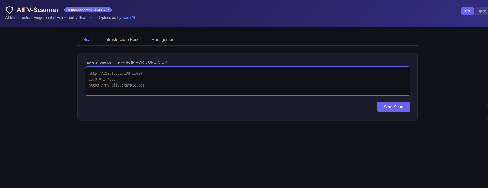
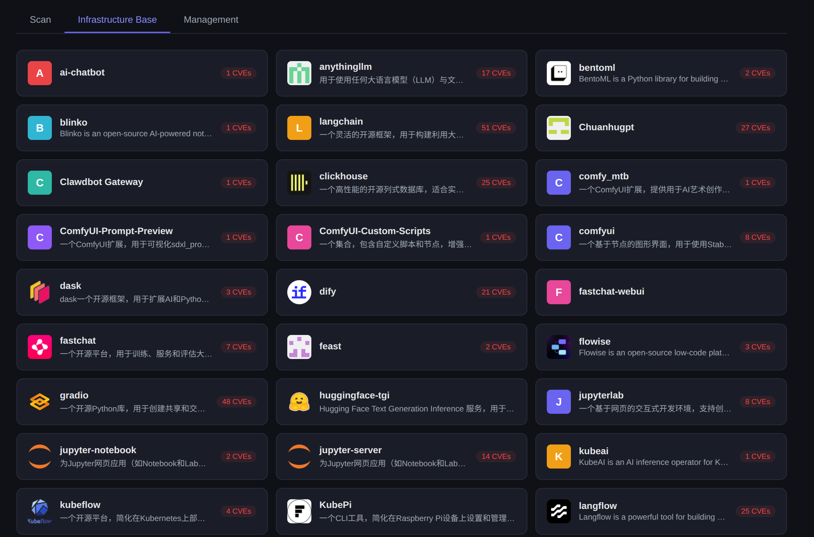
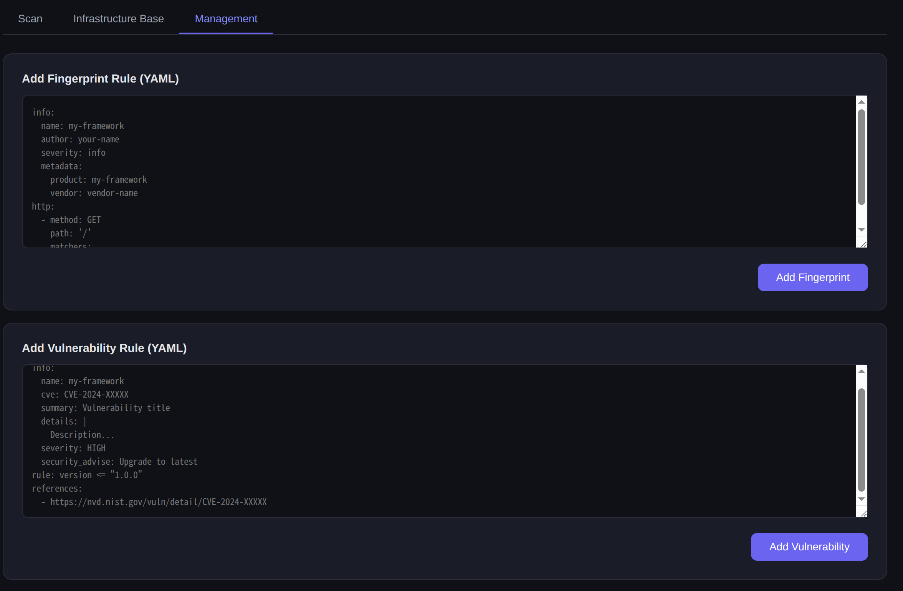

<p align="center">
  <h1 align="center">AIFV-Scanner</h1>
  <p align="center">
    <strong>Detect what AI framework a website is built with & find its vulnerabilities</strong>
  </p>
  <p align="center">
    AI Infrastructure Fingerprinting | Built-With Detection | CVE Vulnerability Scanner
  </p>
  <p align="center">
    <a href="#quick-start">Quick Start</a> &bull;
    <a href="#api-reference">API</a> &bull;
    <a href="#supported-ai-frameworks">60+ Frameworks</a> &bull;
    <a href="#-中文文档">中文</a>
  </p>
</p>

---

**AIFV-Scanner** is a lightweight web tool that answers two questions:

1. **"What AI framework is this website built with?"** — Identify Ollama, vLLM, Dify, Gradio, ComfyUI, LangFlow, Jupyter, and 50+ more AI/ML components by HTTP fingerprinting.
2. **"Is it vulnerable?"** — Match detected components against 1190+ CVE rules with version-aware analysis, in both English and Chinese.

Think of it as a **"Built With" detector + vulnerability scanner**, purpose-built for AI infrastructure.

Extracted and optimized from [AI-Infra-Guard](https://github.com/Tencent/AI-Infra-Guard) by Tencent Zhuque Lab.

## Screenshots

| Scan & Detect | Infrastructure Base | Add Rules |
|---------------|---------------------|-----------|
|  |  |  |

## Features

### Fingerprint Detection — What is it built with?

Probe any URL, IP, or CIDR range and instantly identify the AI/ML framework behind it. Supports 60+ components including LLM serving platforms, AI development tools, MLOps infrastructure, and more.

### CVE Vulnerability Matching

Automatically match detected components and versions against 1190+ known CVE vulnerability rules. Get severity ratings, descriptions, and remediation advice.

### Real-time Streaming Results

SSE-based live progress — see results as each target completes, not after the entire scan finishes.

### Bilingual (English / Chinese)

Full i18n support for the web UI and CVE descriptions. Switch languages with one click.

### Extensible Rule Engine

Add your own fingerprint rules and vulnerability rules at runtime via REST API — no restart needed. YAML-based DSL for both fingerprints and CVE rules.

### One-command Docker Deploy

```bash
docker-compose up -d
```

Single 18MB Go binary with embedded frontend. Host network mode for scanning LAN targets.

## Quick Start

### Docker (Recommended)

```bash
git clone https://github.com/NadirAI/AIFV-Scanner.git
cd AIFV-Scanner
docker-compose up -d
```

Open http://localhost:8899

## Use Cases

| Scenario | How |
|----------|-----|
| **Detect what AI framework a site uses** | Enter any URL and scan — fingerprints reveal the tech stack |
| **Security audit of AI infrastructure** | Scan your LAN/cloud IPs to find exposed AI services and known CVEs |
| **Penetration testing reconnaissance** | Identify targets running vulnerable versions of Ollama, vLLM, Jupyter, etc. |
| **Asset inventory** | Batch scan CIDR ranges to discover all AI/ML services in your network |
| **Custom rule development** | Add your own fingerprint YAML to detect internal or new AI frameworks |

## Configuration

| Environment Variable | Default | Description |
|---------------------|---------|-------------|
| `FP_DIR` | `data/fingerprints` | Fingerprint rules directory |
| `VUL_DIR` | `data/vuln` | CVE rules — Chinese |
| `VUL_DIR_EN` | `data/vuln_en` | CVE rules — English |
| `LISTEN_ADDR` | `:8899` | Listen address |

## API Reference

| Method | Endpoint | Description |
|--------|----------|-------------|
| `POST` | `/api/v1/scan` | Start scan — `{"targets":["..."], "language":"en"}` |
| `GET` | `/api/v1/scan/:id` | Get task status and results |
| `GET` | `/api/v1/scan/:id/stream` | SSE real-time progress stream |
| `GET` | `/api/v1/summary` | Component + CVE overview |
| `GET` | `/api/v1/fingerprints` | List all fingerprint rules |
| `GET` | `/api/v1/vulnerabilities?name=xxx&lang=en` | List CVE rules by component |
| `POST` | `/api/v1/fingerprints` | Add fingerprint rule (YAML body) |
| `DELETE` | `/api/v1/fingerprints/:name` | Delete fingerprint rule |
| `POST` | `/api/v1/vulnerabilities?lang=en` | Add CVE rule (YAML body) |
| `DELETE` | `/api/v1/vulnerabilities/:name/:cve` | Delete CVE rule |

## Supported AI Frameworks

<table>
<tr><th>Category</th><th>Components</th></tr>
<tr><td><strong>LLM Serving</strong></td><td>Ollama, vLLM, Llama.cpp, HuggingFace TGI, NVIDIA NIM, Triton, Xinference, LocalAI, LiteLLM, FastChat, Text Generation WebUI</td></tr>
<tr><td><strong>AI App Platforms</strong></td><td>Dify, LangFlow, Flowise, RAGFlow, n8n, AnythingLLM, PraisonAI</td></tr>
<tr><td><strong>Chat UIs</strong></td><td>Open WebUI, LobeChat, LibreChat, NextChat, ChuanhuGPT</td></tr>
<tr><td><strong>ML/AI Dev Tools</strong></td><td>Gradio, ComfyUI, Jupyter Notebook/Lab/Server, Marimo, TensorBoard, MLflow</td></tr>
<tr><td><strong>MLOps & Infra</strong></td><td>Ray, Kubeflow, BentoML, LangFuse, Feast, Dask, KubePi</td></tr>
<tr><td><strong>Training</strong></td><td>LLaMA-Factory</td></tr>
<tr><td><strong>Data</strong></td><td>ClickHouse</td></tr>
</table>

## License

Based on [AI-Infra-Guard](https://github.com/Tencent/AI-Infra-Guard) by Tencent Zhuque Lab. [MIT License](https://github.com/Tencent/AI-Infra-Guard/blob/main/LICENSE).

---

# <a id="-中文文档"></a>AIFV-Scanner 中文文档

**检测网站使用了什么 AI 框架，并发现其漏洞**

AI 基础设施指纹识别 | Built-With 检测 | CVE 漏洞扫描

---

**AIFV-Scanner** 是一款轻量级 Web 工具，解决两个问题：

1. **"这个网站用了什么 AI 框架？"** — 通过 HTTP 指纹识别 Ollama、vLLM、Dify、Gradio、ComfyUI、LangFlow、Jupyter 等 60+ 种 AI/ML 组件。
2. **"它有漏洞吗？"** — 将检测到的组件与 1190+ 条 CVE 规则进行版本匹配分析，支持中英文双语。

可以理解为专为 AI 基础设施打造的 **"Built With 检测器 + 漏洞扫描器"**。

基于腾讯朱雀实验室 [AI-Infra-Guard](https://github.com/Tencent/AI-Infra-Guard) 提取并优化。

## 界面截图

| 扫描检测 | 基础设施库 | 规则管理 |
|---------|-----------|---------|
|  |  |  |

## 功能特性

### 指纹识别 — 它用了什么？

输入任意 URL、IP 或 CIDR 网段，即时识别背后的 AI/ML 框架。支持 60+ 种组件，涵盖 LLM 推理平台、AI 开发工具、MLOps 基础设施等。

### CVE 漏洞匹配

自动将识别出的组件及版本与 1190+ 条已知 CVE 漏洞规则匹配，提供危险等级、漏洞描述和修复建议。

### 实时流式结果

基于 SSE 的实时进度推送 — 每完成一个目标即时展示结果，无需等待全部扫描完成。

### 中英文双语

Web 界面和 CVE 描述均支持中英文，一键切换。

### 可扩展规则引擎

通过 REST API 动态增删指纹规则和漏洞规则，无需重启服务。指纹和 CVE 规则均采用 YAML DSL。

### 一键 Docker 部署

```bash
docker-compose up -d
```

单个 18MB Go 二进制文件，前端内嵌。host 网络模式，可扫描局域网目标。

## 快速开始

### Docker 部署（推荐）

```bash
git clone https://github.com/NadirAI/AIFV-Scanner.git
cd AIFV-Scanner
docker-compose up -d
```

访问 http://localhost:8899

## 使用场景

| 场景 | 方法 |
|------|------|
| **检测网站使用的 AI 框架** | 输入任意 URL 扫描，指纹揭示技术栈 |
| **AI 基础设施安全审计** | 扫描局域网/云主机 IP，发现暴露的 AI 服务和已知 CVE |
| **渗透测试信息收集** | 识别运行了存在漏洞版本的 Ollama、vLLM、Jupyter 等目标 |
| **资产盘点** | 批量扫描 CIDR 网段，发现网络中所有 AI/ML 服务 |
| **自定义规则开发** | 编写指纹 YAML 来检测内部或新兴 AI 框架 |

## 配置项

| 环境变量 | 默认值 | 说明 |
|---------|--------|------|
| `FP_DIR` | `data/fingerprints` | 指纹规则目录 |
| `VUL_DIR` | `data/vuln` | CVE 规则目录（中文） |
| `VUL_DIR_EN` | `data/vuln_en` | CVE 规则目录（英文） |
| `LISTEN_ADDR` | `:8899` | 监听地址 |

## API 接口

| 方法 | 路径 | 说明 |
|------|------|------|
| `POST` | `/api/v1/scan` | 发起扫描 — `{"targets":["..."], "language":"zh"}` |
| `GET` | `/api/v1/scan/:id` | 获取任务状态和结果 |
| `GET` | `/api/v1/scan/:id/stream` | SSE 实时进度流 |
| `GET` | `/api/v1/summary` | 组件 + CVE 概览 |
| `GET` | `/api/v1/fingerprints` | 列出所有指纹规则 |
| `GET` | `/api/v1/vulnerabilities?name=xxx&lang=zh` | 按组件列出 CVE 规则 |
| `POST` | `/api/v1/fingerprints` | 添加指纹规则（YAML body） |
| `DELETE` | `/api/v1/fingerprints/:name` | 删除指纹规则 |
| `POST` | `/api/v1/vulnerabilities?lang=zh` | 添加 CVE 规则（YAML body） |
| `DELETE` | `/api/v1/vulnerabilities/:name/:cve` | 删除 CVE 规则 |

## 支持的 AI 框架

<table>
<tr><th>分类</th><th>组件</th></tr>
<tr><td><strong>LLM 推理</strong></td><td>Ollama、vLLM、Llama.cpp、HuggingFace TGI、NVIDIA NIM、Triton、Xinference、LocalAI、LiteLLM、FastChat、Text Generation WebUI</td></tr>
<tr><td><strong>AI 应用平台</strong></td><td>Dify、LangFlow、Flowise、RAGFlow、n8n、AnythingLLM、PraisonAI</td></tr>
<tr><td><strong>对话界面</strong></td><td>Open WebUI、LobeChat、LibreChat、NextChat、ChuanhuGPT</td></tr>
<tr><td><strong>ML/AI 开发</strong></td><td>Gradio、ComfyUI、Jupyter Notebook/Lab/Server、Marimo、TensorBoard、MLflow</td></tr>
<tr><td><strong>MLOps 基础设施</strong></td><td>Ray、Kubeflow、BentoML、LangFuse、Feast、Dask、KubePi</td></tr>
<tr><td><strong>训练</strong></td><td>LLaMA-Factory</td></tr>
<tr><td><strong>数据</strong></td><td>ClickHouse</td></tr>
</table>

## 许可证

基于腾讯朱雀实验室 [AI-Infra-Guard](https://github.com/Tencent/AI-Infra-Guard)，遵循 [MIT 许可证](https://github.com/Tencent/AI-Infra-Guard/blob/main/LICENSE)。
